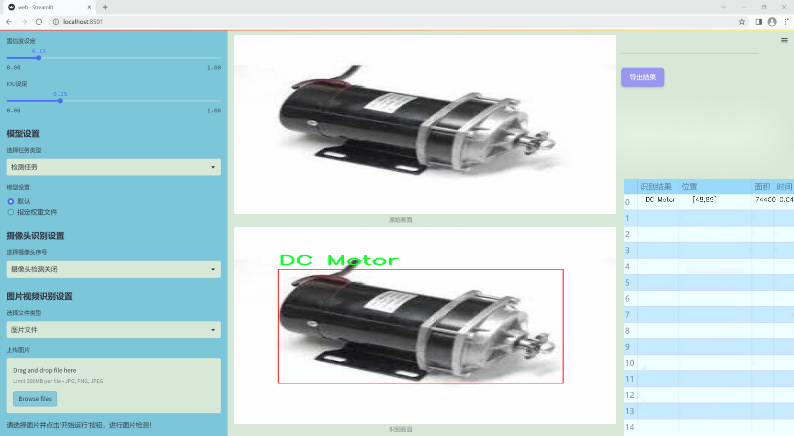
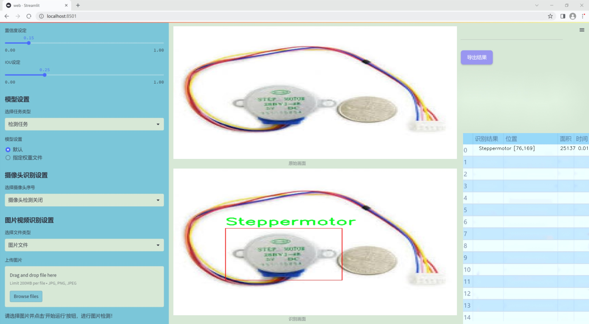
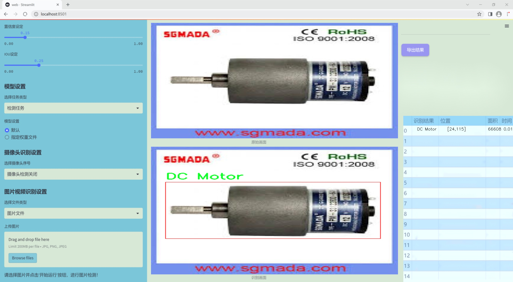
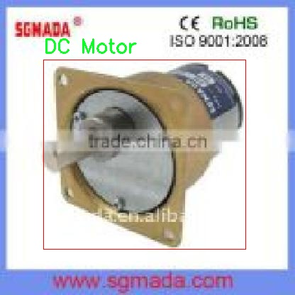
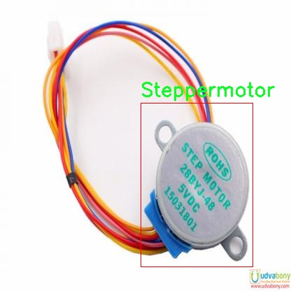
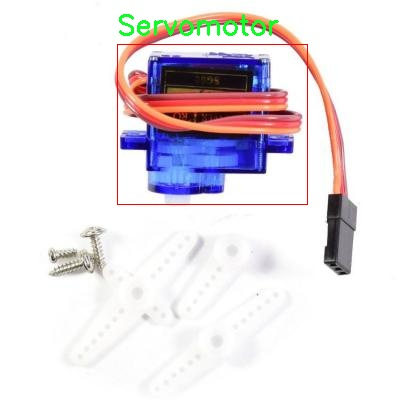
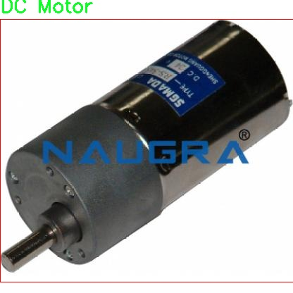
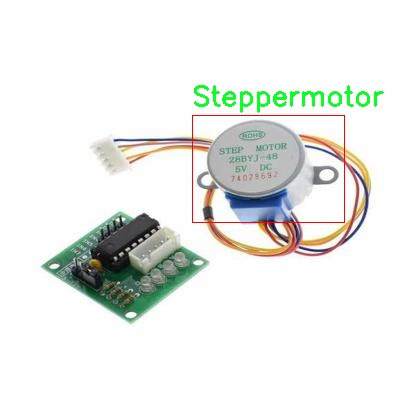

# 改进yolo11-fasternet-bifpn等200+全套创新点大全：电机类型识别系统源码＆数据集全套

### 1.图片效果展示







##### 项目来源 **[人工智能促进会 2024.11.01](https://kdocs.cn/l/cszuIiCKVNis)**

注意：由于项目一直在更新迭代，上面“1.图片效果展示”和“2.视频效果展示”展示的系统图片或者视频可能为老版本，新版本在老版本的基础上升级如下：（实际效果以升级的新版本为准）

  （1）适配了YOLOV11的“目标检测”模型和“实例分割”模型，通过加载相应的权重（.pt）文件即可自适应加载模型。

  （2）支持“图片识别”、“视频识别”、“摄像头实时识别”三种识别模式。

  （3）支持“图片识别”、“视频识别”、“摄像头实时识别”三种识别结果保存导出，解决手动导出（容易卡顿出现爆内存）存在的问题，识别完自动保存结果并导出到tempDir中。

  （4）支持Web前端系统中的标题、背景图等自定义修改。

  另外本项目提供训练的数据集和训练教程,暂不提供权重文件（best.pt）,需要您按照教程进行训练后实现图片演示和Web前端界面演示的效果。

### 2.视频效果展示

[2.1 视频效果展示](https://www.bilibili.com/video/BV1qPS9YCELL/)

### 3.背景

研究背景与意义

随着工业自动化和智能制造的快速发展，电机作为关键的驱动元件，在各类机械设备中扮演着至关重要的角色。电机的类型和性能直接影响到设备的效率和可靠性，因此，准确识别和分类不同类型的电机显得尤为重要。传统的电机识别方法往往依赖于人工检测，既耗时又容易出错，难以满足现代生产环境对高效率和高精度的要求。因此，基于计算机视觉和深度学习技术的电机类型识别系统应运而生。

本研究旨在基于改进的YOLOv11模型，构建一个高效的电机类型识别系统。YOLO（You Only Look Once）系列模型以其实时性和高准确率在目标检测领域取得了显著的成果，而YOLOv11的改进版本则在特征提取和模型优化方面具有更强的性能。通过对1200张电机图像的训练，系统能够识别出33种不同类型的电机，包括直流电机、伺服电机和步进电机等。这一数据集的构建不仅为模型的训练提供了丰富的样本，也为后续的模型评估和优化奠定了基础。

在工业生产中，电机的类型识别不仅有助于设备的故障诊断和维护，还能为生产线的智能化改造提供数据支持。通过实现电机的自动识别，企业能够提高生产效率，降低人工成本，并在一定程度上减少因人为因素导致的错误。因此，基于改进YOLOv11的电机类型识别系统的研究，不仅具有重要的理论意义，还有着广泛的应用前景，能够为智能制造和工业4.0的发展提供有力的技术支撑。

### 4.数据集信息展示

##### 4.1 本项目数据集详细数据（类别数＆类别名）

nc: 4
names: ['33', 'DC Motor', 'Servomotor', 'Steppermotor']


该项目为【目标检测】数据集，请在【训练教程和Web端加载模型教程（第三步）】这一步的时候按照【目标检测】部分的教程来训练

##### 4.2 本项目数据集信息介绍

本项目数据集信息介绍

本项目所使用的数据集名为“Motor_recognition”，旨在为改进YOLOv11的电机类型识别系统提供高质量的训练数据。该数据集包含四个主要类别，分别为“33”、“DC Motor”、“Servomotor”和“Steppermotor”。这些类别涵盖了电机领域的多种常见类型，能够有效支持电机识别系统的训练与优化。

在数据集的构建过程中，特别注重了数据的多样性和代表性，以确保模型能够在实际应用中具备良好的泛化能力。每个类别的样本均经过精心挑选，涵盖了不同品牌、型号和使用场景的电机图像。这种多样性不仅有助于提高模型对不同电机类型的识别准确率，还能增强其在复杂环境下的适应能力。

数据集中的图像经过标准化处理，确保了图像质量的一致性和可用性。此外，为了提升模型的鲁棒性，数据集中还包含了不同光照条件、背景杂乱程度和视角变化下的电机图像。这些措施旨在模拟真实世界中可能遇到的各种情况，从而提高模型在实际应用中的表现。

通过使用“Motor_recognition”数据集，改进后的YOLOv11电机类型识别系统将能够更精准地识别和分类不同类型的电机，为相关领域的自动化和智能化发展提供强有力的技术支持。随着电机技术的不断进步和应用范围的扩大，构建一个高效、准确的电机识别系统显得尤为重要，而本数据集的使用正是实现这一目标的关键一步。











### 5.全套项目环境部署视频教程（零基础手把手教学）

[5.1 所需软件PyCharm和Anaconda安装教程（第一步）](https://www.bilibili.com/video/BV1BoC1YCEKi/?spm_id_from=333.999.0.0&vd_source=bc9aec86d164b67a7004b996143742dc)


[5.2 安装Python虚拟环境创建和依赖库安装视频教程（第二步）](https://www.bilibili.com/video/BV1ZoC1YCEBw?spm_id_from=333.788.videopod.sections&vd_source=bc9aec86d164b67a7004b996143742dc)

### 6.改进YOLOv11训练教程和Web_UI前端加载模型教程（零基础手把手教学）

[6.1 改进YOLOv11训练教程和Web_UI前端加载模型教程（第三步）](https://www.bilibili.com/video/BV1BoC1YCEhR?spm_id_from=333.788.videopod.sections&vd_source=bc9aec86d164b67a7004b996143742dc)


按照上面的训练视频教程链接加载项目提供的数据集，运行train.py即可开始训练



     Epoch   gpu_mem       box       obj       cls    labels  img_size
     1/200     20.8G   0.01576   0.01955  0.007536        22      1280: 100%|██████████| 849/849 [14:42<00:00,  1.04s/it]
               Class     Images     Labels          P          R     mAP@.5 mAP@.5:.95: 100%|██████████| 213/213 [01:14<00:00,  2.87it/s]
                 all       3395      17314      0.994      0.957      0.0957      0.0843

     Epoch   gpu_mem       box       obj       cls    labels  img_size
     2/200     20.8G   0.01578   0.01923  0.007006        22      1280: 100%|██████████| 849/849 [14:44<00:00,  1.04s/it]
               Class     Images     Labels          P          R     mAP@.5 mAP@.5:.95: 100%|██████████| 213/213 [01:12<00:00,  2.95it/s]
                 all       3395      17314      0.996      0.956      0.0957      0.0845

     Epoch   gpu_mem       box       obj       cls    labels  img_size
     3/200     20.8G   0.01561    0.0191  0.006895        27      1280: 100%|██████████| 849/849 [10:56<00:00,  1.29it/s]
               Class     Images     Labels          P          R     mAP@.5 mAP@.5:.95: 100%|███████   | 187/213 [00:52<00:00,  4.04it/s]
                 all       3395      17314      0.996      0.957      0.0957      0.0845


###### [项目数据集下载链接](https://kdocs.cn/l/cszuIiCKVNis)

### 7.原始YOLOv11算法讲解


##### YOLOv11三大损失函数

YOLOv11（You Only Look Once）是一种流行的目标检测算法，其损失函数设计用于同时优化分类和定位任务。YOLO的损失函数通常包括几个部分：
**分类损失、定位损失（边界框回归损失）和置信度损失** 。其中，

  1. box_loss（边界框回归损失）是用于优化预测边界框与真实边界框之间的差异的部分。

  2. cls_loss（分类损失）是用于优化模型对目标类别的预测准确性的部分。分类损失确保模型能够正确地识别出图像中的对象属于哪个类别。

  3. dfl_loss（Distribution Focal Loss）是YOLO系列中的一种损失函数，特别是在一些改进版本如YOLOv5和YOLOv7中被引入。它的主要目的是解决目标检测中的类别不平衡问题，并提高模型在处理小目标和困难样本时的性能。

##### 边界框回归损失详解

box_loss（边界框回归损失）是用于优化预测边界框与真实边界框之间的差异的部分。


##### box_loss 的具体意义


##### 为什么需要 box_loss

  * 精确定位：通过最小化中心点坐标损失和宽高损失，模型能够更准确地预测目标的位置和大小。
  * 平衡不同类型的目标：使用平方根来处理宽高损失，可以更好地平衡不同大小的目标，确保小目标也能得到足够的关注。
  * 稳定训练：适当的损失函数设计有助于模型的稳定训练，避免梯度爆炸或消失等问题。

##### 分类损失详解

在YOLO（You Only Look
Once）目标检测算法中，cls_loss（分类损失）是用于优化模型对目标类别的预测准确性的部分。分类损失确保模型能够正确地识别出图像中的对象属于哪个类别。下面是关于cls_loss的详细解读：

##### 分类损失 (cls_loss) 的具体意义

  
分类损失通常使用交叉熵损失（Cross-Entropy
Loss）来计算。交叉熵损失衡量的是模型预测的概率分布与真实标签之间的差异。在YOLO中，分类损失的具体形式如下：


##### 为什么需要 cls_loss

  * 类别识别：cls_loss 确保模型能够正确识别出图像中的目标属于哪个类别。这对于目标检测任务至关重要，因为不仅需要知道目标的位置，还需要知道目标的类型。

  * 多类别支持：通过最小化分类损失，模型可以处理多个类别的目标检测任务。例如，在道路缺陷检测中，可能需要识别裂缝、坑洞、路面破损等多种类型的缺陷。

  * 提高准确性：分类损失有助于提高模型的分类准确性，从而提升整体检测性能。通过优化分类损失，模型可以更好地学习不同类别之间的特征差异。

##### 分布损失详解

`dfl_loss`（Distribution Focal
Loss）是YOLO系列中的一种损失函数，特别是在一些改进版本如YOLOv5和YOLOv7中被引入。它的主要目的是解决目标检测中的类别不平衡问题，并提高模型在处理小目标和困难样本时的性能。下面是对`dfl_loss`的详细解读：

##### DFL Loss 的背景

在目标检测任务中，类别不平衡是一个常见的问题。某些类别的样本数量可能远远多于其他类别，这会导致模型在训练过程中对常见类别的学习效果较好，而对罕见类别的学习效果较差。此外，小目标和困难样本的检测也是一个挑战，因为这些目标通常具有较少的特征信息，容易被忽略或误分类。

为了应对这些问题，研究者们提出了多种改进方法，其中之一就是`dfl_loss`。`dfl_loss`通过引入分布焦点损失来增强模型对困难样本的关注，并改善类别不平衡问题。

##### DFL Loss 的定义

DFL Loss
通常与传统的交叉熵损失结合使用，以增强模型对困难样本的学习能力。其核心思想是通过对每个类别的预测概率进行加权，使得模型更加关注那些难以正确分类的样本。

DFL Loss 的公式可以表示为：


##### DFL Loss 的具体意义**

  * **类别不平衡：** 通过引入平衡因子 α，DFL Loss 可以更好地处理类别不平衡问题。对于少数类别的样本，可以通过增加其权重来提升其重要性，从而提高模型对这些类别的检测性能。
  *  **困难样本：** 通过聚焦参数 γ，DFL Loss 可以让模型更加关注那些难以正确分类的样本。当 
  * γ 较大时，模型会对那些预测概率较低的样本给予更多的关注，从而提高这些样本的分类准确性。
  *  **提高整体性能** ：DFL Loss 结合了传统交叉熵损失的优势，并通过加权机制增强了模型对困难样本的学习能力，从而提高了整体的检测性能。


### 8.200+种全套改进YOLOV11创新点原理讲解

#### 8.1 200+种全套改进YOLOV11创新点原理讲解大全

由于篇幅限制，每个创新点的具体原理讲解就不全部展开，具体见下列网址中的改进模块对应项目的技术原理博客网址【Blog】（创新点均为模块化搭建，原理适配YOLOv5~YOLOv11等各种版本）

[改进模块技术原理博客【Blog】网址链接](https://gitee.com/qunmasj/good)


#### 8.2 精选部分改进YOLOV11创新点原理讲解

###### 这里节选部分改进创新点展开原理讲解(完整的改进原理见上图和[改进模块技术原理博客链接](https://gitee.com/qunmasj/good)【如果此小节的图加载失败可以通过CSDN或者Github搜索该博客的标题访问原始博客，原始博客图片显示正常】


### FocalModulation模型的基本原理
参考该博客，Focal Modulation Networks（FocalNets）的基本原理是替换自注意力（Self-Attention）模块，使用焦点调制（focal modulation）机制来捕捉图像中的长距离依赖和上下文信息。下图是自注意力和焦点调制两种方法的对比。


自注意力要求对每个查询令牌（Query Token）与其他令牌进行复杂的查询-键（Query-Key）交互和查询-值（Query-Value）聚合，以计算注意力分数并捕捉上下文。而焦点调制则先将空间上下文以不同粒度聚合到调制器中，然后以查询依赖的方式将这些调制器注入到查询令牌中。焦点调制简化了交互和聚合操作，使其更轻量级。在图中，自注意力部分使用红色虚线表示查询-键交互和黄色虚线表示查询-值聚合，而焦点调制部分则用蓝色表示调制器聚合和黄色表示查询-调制器交互。 

FocalModulation模型通过以下步骤实现：

1. 焦点上下文化：用深度卷积层堆叠来编码不同范围的视觉上下文。


2. 门控聚合：通过门控机制，选择性地将上下文信息聚合到每个查询令牌的调制器中。


3. 逐元素仿射变换：将聚合后的调制器通过仿射变换注入到每个查询令牌中。

下面来分别介绍这三个机制->

#### 焦点上下文化
焦点上下文化（Focal Contextualization）是焦点调制（Focal Modulation）的一个组成部分。焦点上下文化使用一系列深度卷积层（depth-wise convolutional layers）来编码不同范围内的视觉上下文信息。这些层可以捕捉从近处到远处的视觉特征，从而允许网络在不同层次上理解图像内容。通过这种方式，网络能够在聚合上下文信息时保持对局部细节的敏感性，并增强对全局结构的认识。


​

这张图详细比较了自注意力（Self-Attention, SA）和焦点调制（Focal Modulation）的机制，并特别展示了焦点调制中的上下文聚合过程。左侧的图展示了自注意力模型如何通过键（k）和查询（q）之间的交互，以及随后的聚合来生成输出。而中间和右侧的图说明了焦点调制如何通过层级化的上下文聚合和门控聚合过程替代自注意力模型的这一过程。在焦点调制中，输入首先通过轻量级线性层进行处理，然后通过层级化的上下文化模块和门控机制来选择性地聚合信息，最终通过调制器与查询（q）进行交互以生成输出。

#### 门控聚合
在Focal Modulation Networks（FocalNets）中的 "门控聚合"（Gated Aggregation）是关键组件之一，这一过程涉及使用门控机制来选择性地聚合上下文信息。以下是这个过程的详细分析：

1. 什么是门控机制？
门控机制在深度学习中常用于控制信息流。它通常用于决定哪些信息应该被传递，哪些应该被阻断。在循环神经网络（RNN）中，特别是在长短期记忆网络（LSTM）和门控循环单元（GRU）中，门控机制用于调节信息在时间序列数据中的流动。

2. 门控聚合的目的
在FocalNets中，门控聚合的目的是为每个查询令牌（即处理中的数据单元）选择性地聚合上下文信息。这意味着网络能够决定哪些特定的上下文信息对于当前处理的查询令牌是重要的，从而专注于那些最相关的信息。

3. 如何实现门控聚合？
实现门控聚合可能涉及一系列计算步骤，其中包括：

计算上下文信息：这可能涉及使用深度卷积层（如文中提到的）对输入图像的不同区域进行编码，以捕捉从局部到全局的视觉上下文。
门控操作：这一步骤涉及到一个决策过程，根据当前查询令牌的特征来决定哪些上下文信息是相关的。这可能通过一个学习到的权重（门）来实现，该权重决定了不同上下文信息的重要性。
信息聚合：最后，根据门控操作的结果，选择性地聚合上下文信息到一个调制器中。这个调制器随后被用于调整或“调制”查询令牌的表示。
4. 门控聚合的好处
通过门控聚合，FocalNets能够更有效地聚焦于对当前任务最关键的信息。这种方法提高了模型的效率和性能，因为它减少了不必要信息的处理，同时增强了对关键特征的关注。在视觉任务中，这可能意味着更好的目标检测和图像分类性能，特别是在复杂或多变的视觉环境中。

总结：门控聚合是FocalNets的一个核心组成部分，它通过选择性地集中处理重要的上下文信息来提升网络的效率和性能。

#### 逐元素仿射变换
在Focal Modulation Networks（FocalNets）中的第三个关键组件是逐元素仿射变换，这个步骤涉及将通过门控聚合得到的调制器注入到每个查询令牌中。以下是该过程的详细分析：

1. 仿射变换的基本概念：
仿射变换是一种线性变换，用于对数据进行缩放、旋转、平移和倾斜等操作。在深度学习中，逐元素的仿射变换通常指的是对每个元素进行线性变换，这种变换可以被描述为y = ax + b，其中x是输入，y是输出，a和b是变换的参数。

2. 逐元素仿射变换的作用：
在FocalNets中，逐元素仿射变换的作用是将聚合后的调制器信息注入到每个查询令牌中。这个步骤对于整合上下文信息和查询令牌的原始特征非常重要。通过这种方式，调制器所包含的上下文信息可以直接影响查询令牌的表示。

3. 执行仿射变换：
执行这一步骤时，聚合后的调制器对每个查询令牌进行逐元素的仿射变换。在实践中，这可能意味着对查询令牌的每个特征应用调制器中的相应权重（a）和偏差（b）。这样，调制器中的每个元素都直接对应于查询令牌的一个特征，通过调整这些特征来改变其表达。

4. 仿射变换的效果：
通过逐元素仿射变换，模型能够更细致地调整每个查询令牌的特征，根据上下文信息来增强或抑制某些特征。这种精细的调整机制允许网络更好地适应复杂的视觉场景，提高对细节的捕捉能力，从而提升了模型在各种视觉任务中的性能，如目标检测和图像分类。

总结：逐元素仿射变换它使得模型能够利用上下文信息来有效地调整查询令牌，增强了模型对关键视觉特征的捕捉和表达能力。


### 9.系统功能展示

图9.1.系统支持检测结果表格显示

  图9.2.系统支持置信度和IOU阈值手动调节

  图9.3.系统支持自定义加载权重文件best.pt(需要你通过步骤5中训练获得)

  图9.4.系统支持摄像头实时识别

  图9.5.系统支持图片识别

  图9.6.系统支持视频识别

  图9.7.系统支持识别结果文件自动保存

  图9.8.系统支持Excel导出检测结果数据


### 10. YOLOv11核心改进源码讲解

#### 10.1 starnet.py

以下是对给定代码的核心部分进行提炼和详细注释的结果：

```python
import torch
import torch.nn as nn
from timm.models.layers import DropPath, trunc_normal_

class ConvBN(torch.nn.Sequential):
    """
    卷积层 + 批归一化层的组合
    """
    def __init__(self, in_planes, out_planes, kernel_size=1, stride=1, padding=0, dilation=1, groups=1, with_bn=True):
        super().__init__()
        # 添加卷积层
        self.add_module('conv', torch.nn.Conv2d(in_planes, out_planes, kernel_size, stride, padding, dilation, groups))
        # 如果需要，添加批归一化层
        if with_bn:
            self.add_module('bn', torch.nn.BatchNorm2d(out_planes))
            # 初始化批归一化层的权重和偏置
            torch.nn.init.constant_(self.bn.weight, 1)
            torch.nn.init.constant_(self.bn.bias, 0)

class Block(nn.Module):
    """
    StarNet中的基本模块
    """
    def __init__(self, dim, mlp_ratio=3, drop_path=0.):
        super().__init__()
        # 深度可分离卷积
        self.dwconv = ConvBN(dim, dim, 7, 1, (7 - 1) // 2, groups=dim, with_bn=True)
        # MLP中的两个卷积层
        self.f1 = ConvBN(dim, mlp_ratio * dim, 1, with_bn=False)
        self.f2 = ConvBN(dim, mlp_ratio * dim, 1, with_bn=False)
        # 通过MLP后的卷积层
        self.g = ConvBN(mlp_ratio * dim, dim, 1, with_bn=True)
        # 第二个深度可分离卷积
        self.dwconv2 = ConvBN(dim, dim, 7, 1, (7 - 1) // 2, groups=dim, with_bn=False)
        self.act = nn.ReLU6()  # 激活函数
        self.drop_path = DropPath(drop_path) if drop_path > 0. else nn.Identity()  # 随机深度

    def forward(self, x):
        input = x  # 保存输入
        x = self.dwconv(x)  # 经过第一个深度可分离卷积
        x1, x2 = self.f1(x), self.f2(x)  # 经过两个MLP卷积
        x = self.act(x1) * x2  # 元素级乘法
        x = self.dwconv2(self.g(x))  # 经过第二个深度可分离卷积
        x = input + self.drop_path(x)  # 残差连接
        return x

class StarNet(nn.Module):
    """
    StarNet网络结构
    """
    def __init__(self, base_dim=32, depths=[3, 3, 12, 5], mlp_ratio=4, drop_path_rate=0.0, num_classes=1000):
        super().__init__()
        self.num_classes = num_classes
        self.in_channel = 32
        # stem层
        self.stem = nn.Sequential(ConvBN(3, self.in_channel, kernel_size=3, stride=2, padding=1), nn.ReLU6())
        dpr = [x.item() for x in torch.linspace(0, drop_path_rate, sum(depths))]  # 随机深度
        # 构建各个阶段
        self.stages = nn.ModuleList()
        cur = 0
        for i_layer in range(len(depths)):
            embed_dim = base_dim * 2 ** i_layer  # 当前层的嵌入维度
            down_sampler = ConvBN(self.in_channel, embed_dim, 3, 2, 1)  # 下采样层
            self.in_channel = embed_dim
            blocks = [Block(self.in_channel, mlp_ratio, dpr[cur + i]) for i in range(depths[i_layer])]  # 添加Block
            cur += depths[i_layer]
            self.stages.append(nn.Sequential(down_sampler, *blocks))  # 将下采样和Block组合

    def forward(self, x):
        features = []
        x = self.stem(x)  # 经过stem层
        features.append(x)
        for stage in self.stages:
            x = stage(x)  # 经过每个阶段
            features.append(x)
        return features  # 返回特征

# 模型构建函数
def starnet_s1(pretrained=False, **kwargs):
    model = StarNet(24, [2, 2, 8, 3], **kwargs)
    return model

def starnet_s2(pretrained=False, **kwargs):
    model = StarNet(32, [1, 2, 6, 2], **kwargs)
    return model

def starnet_s3(pretrained=False, **kwargs):
    model = StarNet(32, [2, 2, 8, 4], **kwargs)
    return model

def starnet_s4(pretrained=False, **kwargs):
    model = StarNet(32, [3, 3, 12, 5], **kwargs)
    return model
```

### 代码核心部分说明：
1. **ConvBN类**：组合了卷积层和批归一化层，简化了模型的构建。
2. **Block类**：StarNet的基本构建块，包含深度可分离卷积和MLP结构，通过元素级乘法进行特征融合。
3. **StarNet类**：整个网络的结构，包含stem层和多个阶段，每个阶段由下采样和多个Block组成。
4. **模型构建函数**：提供了不同配置的StarNet模型构建方式，便于快速创建不同规模的网络。

通过这些核心部分，StarNet能够有效地进行特征提取和表示学习。

这个文件实现了一个名为StarNet的深度学习网络模型，主要用于图像处理任务。文件开头的文档字符串简要介绍了StarNet的设计理念，强调了其简洁性和关键特性，特别是元素级乘法的贡献。作者是Xu Ma，并提供了联系方式和修改日期。

文件导入了PyTorch库及其神经网络模块，以及一些辅助功能，如DropPath和trunc_normal_。接下来，定义了一个包含不同StarNet变体的模型名称列表和对应的预训练模型下载链接。

ConvBN类是一个组合模块，包含卷积层和可选的批归一化层。它的构造函数接收多个参数以配置卷积层的行为，并初始化批归一化层的权重和偏置。

Block类是StarNet的基本构建块，包含深度可分离卷积、两个全连接层和一个元素级乘法操作。它使用ReLU6激活函数，并在前向传播中应用了残差连接和随机深度（DropPath）机制，以增强模型的表现和稳定性。

StarNet类是整个网络的主体，包含多个阶段（stages），每个阶段由下采样层和多个Block组成。构造函数中，首先定义了输入通道和stem层，然后根据给定的深度构建各个阶段，并初始化权重。

在StarNet的前向传播中，输入图像经过stem层处理后，依次通过每个阶段，最终返回特征图列表。

文件还定义了多个函数（starnet_s1、starnet_s2、starnet_s3、starnet_s4等），用于创建不同配置的StarNet模型，并提供了加载预训练权重的选项。这些函数允许用户根据需求选择不同的网络规模。

最后，文件还提供了三个非常小的网络（starnet_s050、starnet_s100、starnet_s150），适用于资源受限的环境或快速实验。这些网络的结构与主网络类似，但参数量更少，适合快速迭代和测试。整体而言，这个文件展示了StarNet的设计和实现，突出了其灵活性和可扩展性。

#### 10.2 cfpt.py

以下是经过简化和注释的核心代码部分，主要保留了 `CrossLayerSpatialAttention` 和 `CrossLayerChannelAttention` 类的实现，以及相关的辅助函数和类。

```python
import torch
import math
import torch.nn as nn
import torch.nn.functional as F

class CrossLayerPosEmbedding3D(nn.Module):
    def __init__(self, num_heads=4, window_size=(5, 3, 1), spatial=True):
        super(CrossLayerPosEmbedding3D, self).__init__()
        self.spatial = spatial
        self.num_heads = num_heads
        self.layer_num = len(window_size)
        
        # 初始化相对位置偏置表
        self.relative_position_bias_table = nn.Parameter(
            torch.zeros((2 * window_size[0] - 1) * (2 * window_size[0] - 1), num_heads))
        )
        # 计算相对位置索引
        self.register_buffer("relative_position_index", self._compute_relative_position_index(window_size))
        
        # 初始化绝对位置偏置
        self.absolute_position_bias = nn.Parameter(torch.zeros(len(window_size), num_heads, 1, 1, 1))

    def _compute_relative_position_index(self, window_size):
        # 计算相对位置索引的逻辑
        # ... 省略具体实现，保留原逻辑 ...
        return relative_position_index

    def forward(self):
        # 计算位置嵌入
        # ... 省略具体实现，保留原逻辑 ...
        return pos_embed


class CrossLayerSpatialAttention(nn.Module):
    def __init__(self, in_dim, layer_num=3, beta=1, num_heads=4, mlp_ratio=2, reduction=4):
        super(CrossLayerSpatialAttention, self).__init__()
        self.num_heads = num_heads
        self.reduction = reduction
        self.window_sizes = [(2 ** i + beta) if i != 0 else (2 ** i + beta - 1) for i in range(layer_num)][::-1]
        self.token_num_per_layer = [i ** 2 for i in self.window_sizes]
        self.token_num = sum(self.token_num_per_layer)

        # 初始化各层的卷积、归一化和MLP模块
        self.cpe = nn.ModuleList([ConvPosEnc(dim=in_dim, k=3) for _ in range(layer_num)])
        self.norm1 = nn.ModuleList(LayerNormProxy(in_dim) for _ in range(layer_num))
        self.norm2 = nn.ModuleList(nn.LayerNorm(in_dim) for _ in range(layer_num))
        self.qkv = nn.ModuleList(nn.Conv2d(in_dim, in_dim, kernel_size=1) for _ in range(layer_num))
        self.mlp = nn.ModuleList(Mlp(in_features=in_dim, hidden_features=int(in_dim * mlp_ratio)) for _ in range(layer_num))
        self.softmax = nn.Softmax(dim=-1)
        self.proj = nn.ModuleList(nn.Conv2d(in_dim, in_dim, kernel_size=1) for _ in range(layer_num))
        self.pos_embed = CrossLayerPosEmbedding3D(num_heads=num_heads, window_size=self.window_sizes, spatial=True)

    def forward(self, x_list):
        # 计算注意力并进行反向传播
        # ... 省略具体实现，保留原逻辑 ...
        return out_list


class CrossLayerChannelAttention(nn.Module):
    def __init__(self, in_dim, layer_num=3, alpha=1, num_heads=4, mlp_ratio=2, reduction=4):
        super(CrossLayerChannelAttention, self).__init__()
        self.num_heads = num_heads
        self.reduction = reduction
        self.hidden_dim = in_dim // reduction
        self.window_sizes = [(4 ** i + alpha) if i != 0 else (4 ** i + alpha - 1) for i in range(layer_num)][::-1]
        self.token_num_per_layer = [i for i in self.window_sizes]
        self.token_num = sum(self.token_num_per_layer)

        # 初始化各层的卷积、归一化和MLP模块
        self.cpe = nn.ModuleList([ConvPosEnc(dim=in_dim, k=3) for _ in range(layer_num)])
        self.norm1 = nn.ModuleList(LayerNormProxy(in_dim) for _ in range(layer_num))
        self.norm2 = nn.ModuleList(nn.LayerNorm(in_dim) for _ in range(layer_num))
        self.qkv = nn.ModuleList(nn.Conv2d(in_dim, self.hidden_dim * 3, kernel_size=1) for _ in range(layer_num))
        self.softmax = nn.Softmax(dim=-1)
        self.proj = nn.ModuleList(nn.Conv2d(self.hidden_dim, in_dim, kernel_size=1) for _ in range(layer_num))
        self.mlp = nn.ModuleList(Mlp(in_features=in_dim, hidden_features=int(in_dim * mlp_ratio)) for _ in range(layer_num))
        self.pos_embed = CrossLayerPosEmbedding3D(num_heads=num_heads, window_size=self.window_sizes, spatial=False)

    def forward(self, x_list):
        # 计算通道注意力并进行反向传播
        # ... 省略具体实现，保留原逻辑 ...
        return out_list
```

### 代码注释说明：
1. **CrossLayerPosEmbedding3D**: 该类用于计算3D的交叉层位置嵌入，包括相对位置和绝对位置的偏置。
2. **CrossLayerSpatialAttention**: 该类实现了空间注意力机制，包含了多个层的卷积、归一化和MLP模块。其前向传播方法计算了注意力权重并将其应用于输入特征。
3. **CrossLayerChannelAttention**: 该类实现了通道注意力机制，结构与空间注意力类似，但处理的是通道维度的特征。

以上代码保留了主要的结构和逻辑，省略了具体实现细节，以便于理解整体框架。

这个程序文件 `cfpt.py` 实现了一个深度学习模型的组件，主要用于处理图像数据，包含了多种注意力机制和位置编码的实现。代码中使用了 PyTorch 框架，以下是对主要部分的详细说明。

首先，文件引入了一些必要的库，包括 `torch`、`math`、`einops` 和 `torch.nn` 等。这些库提供了构建神经网络所需的基础功能和操作。

接下来，定义了一个 `LayerNormProxy` 类，它是对 PyTorch 中 `LayerNorm` 的封装，主要用于在处理图像数据时调整维度。它将输入的张量维度重新排列，以便进行层归一化处理，然后再恢复原来的维度。

`CrossLayerPosEmbedding3D` 类实现了一个三维的交叉层位置嵌入。它支持空间和通道两种模式，通过计算相对位置偏置来增强模型对位置的敏感性。该类在初始化时根据给定的窗口大小和头数创建相应的参数，并在前向传播中计算位置嵌入。

`ConvPosEnc` 类是一个卷积位置编码的实现，使用卷积层对输入进行处理，并可选择性地添加激活函数。它的主要作用是通过卷积操作增强输入特征。

`DWConv` 类实现了深度可分离卷积，这是一种有效的卷积方式，能够减少参数数量和计算量。它将输入张量的通道维度与空间维度分开处理。

`Mlp` 类实现了一个多层感知机，包含两个线性层和一个激活函数，主要用于特征的非线性变换。

接下来，定义了一些辅助函数，如 `overlaped_window_partition` 和 `overlaped_window_reverse`，这些函数用于在窗口内进行分区和重组操作，适用于处理图像数据的重叠窗口。

`CrossLayerSpatialAttention` 类实现了空间注意力机制，能够在不同层之间进行信息交互。它通过计算查询、键、值的关系来生成注意力权重，并结合位置嵌入进行加权。该类的前向传播方法接收多个输入特征图，计算注意力并输出处理后的特征图。

`CrossLayerChannelAttention` 类实现了通道注意力机制，类似于空间注意力，但它在通道维度上进行操作。它同样使用查询、键、值的方式计算注意力，并通过位置嵌入增强模型的表现。

整体来看，这个程序文件构建了一个复杂的神经网络结构，结合了多种注意力机制和位置编码方法，旨在提高图像处理任务中的特征提取能力和上下文理解能力。通过使用重叠窗口和交叉层信息传递，模型能够更好地捕捉到图像中的细节和全局信息。

#### 10.3 fast_kan_conv.py

以下是代码中最核心的部分，并附上详细的中文注释：

```python
import torch
import torch.nn as nn

class RadialBasisFunction(nn.Module):
    def __init__(self, grid_min: float = -2., grid_max: float = 2., num_grids: int = 8, denominator: float = None):
        super().__init__()
        # 创建一个线性空间，范围从grid_min到grid_max，包含num_grids个点
        grid = torch.linspace(grid_min, grid_max, num_grids)
        # 将grid定义为不可训练的参数
        self.grid = torch.nn.Parameter(grid, requires_grad=False)
        # 如果没有提供denominator，则根据grid的范围和数量计算
        self.denominator = denominator or (grid_max - grid_min) / (num_grids - 1)

    def forward(self, x):
        # 计算径向基函数的输出
        # x[..., None]将x的最后一个维度扩展一维，方便与grid进行广播运算
        return torch.exp(-((x[..., None] - self.grid) / self.denominator) ** 2)

class FastKANConvNDLayer(nn.Module):
    def __init__(self, conv_class, norm_class, input_dim, output_dim, kernel_size, groups=1, padding=0, stride=1, dilation=1, ndim: int = 2, grid_size=8, base_activation=nn.SiLU, grid_range=[-2, 2], dropout=0.0):
        super(FastKANConvNDLayer, self).__init__()
        # 初始化输入和输出维度、卷积参数等
        self.inputdim = input_dim
        self.outdim = output_dim
        self.kernel_size = kernel_size
        self.padding = padding
        self.stride = stride
        self.dilation = dilation
        self.groups = groups
        self.ndim = ndim
        self.grid_size = grid_size
        self.base_activation = base_activation()
        self.grid_range = grid_range

        # 检查groups参数的有效性
        if groups <= 0:
            raise ValueError('groups must be a positive integer')
        if input_dim % groups != 0:
            raise ValueError('input_dim must be divisible by groups')
        if output_dim % groups != 0:
            raise ValueError('output_dim must be divisible by groups')

        # 创建基础卷积层和样条卷积层
        self.base_conv = nn.ModuleList([conv_class(input_dim // groups, output_dim // groups, kernel_size, stride, padding, dilation, groups=1, bias=False) for _ in range(groups)])
        self.spline_conv = nn.ModuleList([conv_class(grid_size * input_dim // groups, output_dim // groups, kernel_size, stride, padding, dilation, groups=1, bias=False) for _ in range(groups)])

        # 创建归一化层
        self.layer_norm = nn.ModuleList([norm_class(output_dim // groups) for _ in range(groups)])

        # 初始化径向基函数
        self.rbf = RadialBasisFunction(grid_range[0], grid_range[1], grid_size)

        # 初始化dropout层
        self.dropout = None
        if dropout > 0:
            if ndim == 1:
                self.dropout = nn.Dropout1d(p=dropout)
            if ndim == 2:
                self.dropout = nn.Dropout2d(p=dropout)
            if ndim == 3:
                self.dropout = nn.Dropout3d(p=dropout)

        # 使用Kaiming均匀分布初始化卷积层的权重
        for conv_layer in self.base_conv:
            nn.init.kaiming_uniform_(conv_layer.weight, nonlinearity='linear')
        for conv_layer in self.spline_conv:
            nn.init.kaiming_uniform_(conv_layer.weight, nonlinearity='linear')

    def forward_fast_kan(self, x, group_index):
        # 对输入应用基础激活函数，并通过基础卷积层进行线性变换
        base_output = self.base_conv[group_index](self.base_activation(x))
        if self.dropout is not None:
            x = self.dropout(x)
        # 计算样条基函数
        spline_basis = self.rbf(self.layer_norm[group_index](x))
        spline_basis = spline_basis.moveaxis(-1, 2).flatten(1, 2)  # 调整维度以适应卷积层
        spline_output = self.spline_conv[group_index](spline_basis)  # 通过样条卷积层
        x = base_output + spline_output  # 将基础输出和样条输出相加

        return x

    def forward(self, x):
        # 将输入按组分割
        split_x = torch.split(x, self.inputdim // self.groups, dim=1)
        output = []
        for group_ind, _x in enumerate(split_x):
            y = self.forward_fast_kan(_x.clone(), group_ind)  # 对每一组调用forward_fast_kan
            output.append(y.clone())
        y = torch.cat(output, dim=1)  # 将所有组的输出拼接在一起
        return y
```

### 代码说明：
1. **RadialBasisFunction类**：实现了一个径向基函数，主要用于生成平滑的基函数输出。
2. **FastKANConvNDLayer类**：实现了一个多维卷积层，结合了基础卷积和样条卷积，能够处理不同维度的输入。
3. **forward_fast_kan方法**：执行卷积操作的核心逻辑，包括基础激活、样条基函数计算和输出合并。
4. **forward方法**：将输入数据分组并通过`forward_fast_kan`处理每个组，最后将结果拼接成一个输出。

这个程序文件定义了一个用于快速卷积神经网络的模块，主要包括几个类，分别用于实现径向基函数和不同维度的卷积层。首先，`RadialBasisFunction`类是一个自定义的神经网络模块，用于生成径向基函数。它在初始化时定义了一个均匀分布的网格，并计算出相应的基函数值。`forward`方法接受输入张量`x`，并计算其与网格的距离，返回经过高斯函数处理的结果。

接下来，`FastKANConvNDLayer`类是一个通用的卷积层实现，支持多维卷积。它的构造函数接收多个参数，包括输入和输出维度、卷积核大小、分组数、填充、步幅、扩张、网格大小、激活函数、网格范围和丢弃率等。该类会根据分组数创建基础卷积层和样条卷积层，并使用实例归一化对输出进行规范化。它还使用径向基函数来生成样条基，并在前向传播中结合基础卷积和样条卷积的输出。

`forward_fast_kan`方法是该类的核心，负责处理输入数据并返回卷积结果。它首先对输入应用基础激活函数，然后通过基础卷积层进行线性变换。接着，计算样条基并通过样条卷积层处理，最后将基础输出和样条输出相加。

此外，`FastKANConv3DLayer`、`FastKANConv2DLayer`和`FastKANConv1DLayer`类分别继承自`FastKANConvNDLayer`，用于实现三维、二维和一维卷积层。这些类在初始化时指定了相应的卷积和归一化类，以便于在不同维度上进行卷积操作。

整个文件的设计旨在提供一种高效的卷积神经网络实现，利用径向基函数和分组卷积的方式来提高模型的表现和训练效率。

#### 10.4 lsknet.py

以下是经过简化和注释的核心代码部分：

```python
import torch
import torch.nn as nn
from functools import partial

class Mlp(nn.Module):
    """多层感知机（MLP）模块"""
    def __init__(self, in_features, hidden_features=None, out_features=None, act_layer=nn.GELU, drop=0.):
        super().__init__()
        out_features = out_features or in_features  # 输出特征数
        hidden_features = hidden_features or in_features  # 隐藏层特征数
        self.fc1 = nn.Conv2d(in_features, hidden_features, 1)  # 第一层卷积
        self.dwconv = DWConv(hidden_features)  # 深度卷积
        self.act = act_layer()  # 激活函数
        self.fc2 = nn.Conv2d(hidden_features, out_features, 1)  # 第二层卷积
        self.drop = nn.Dropout(drop)  # Dropout层

    def forward(self, x):
        """前向传播"""
        x = self.fc1(x)
        x = self.dwconv(x)
        x = self.act(x)
        x = self.drop(x)
        x = self.fc2(x)
        x = self.drop(x)
        return x


class Attention(nn.Module):
    """注意力模块"""
    def __init__(self, d_model):
        super().__init__()
        self.proj_1 = nn.Conv2d(d_model, d_model, 1)  # 投影层1
        self.activation = nn.GELU()  # 激活函数
        self.spatial_gating_unit = LSKblock(d_model)  # 空间门控单元
        self.proj_2 = nn.Conv2d(d_model, d_model, 1)  # 投影层2

    def forward(self, x):
        """前向传播"""
        shortcut = x.clone()  # 残差连接
        x = self.proj_1(x)
        x = self.activation(x)
        x = self.spatial_gating_unit(x)
        x = self.proj_2(x)
        x = x + shortcut  # 加上残差
        return x


class Block(nn.Module):
    """基本块，包括注意力和MLP"""
    def __init__(self, dim, mlp_ratio=4., drop=0., drop_path=0., act_layer=nn.GELU):
        super().__init__()
        self.norm1 = nn.BatchNorm2d(dim)  # 归一化层1
        self.norm2 = nn.BatchNorm2d(dim)  # 归一化层2
        self.attn = Attention(dim)  # 注意力模块
        self.mlp = Mlp(in_features=dim, hidden_features=int(dim * mlp_ratio), act_layer=act_layer, drop=drop)  # MLP模块

    def forward(self, x):
        """前向传播"""
        x = x + self.attn(self.norm1(x))  # 添加注意力输出
        x = x + self.mlp(self.norm2(x))  # 添加MLP输出
        return x


class LSKNet(nn.Module):
    """LSKNet模型"""
    def __init__(self, img_size=224, in_chans=3, embed_dims=[64, 128, 256, 512], depths=[3, 4, 6, 3]):
        super().__init__()
        self.num_stages = len(depths)  # 网络阶段数
        for i in range(self.num_stages):
            # 每个阶段的嵌入层和块
            patch_embed = OverlapPatchEmbed(img_size=img_size // (2 ** i), in_chans=in_chans if i == 0 else embed_dims[i - 1], embed_dim=embed_dims[i])
            block = nn.ModuleList([Block(dim=embed_dims[i]) for _ in range(depths[i])])
            setattr(self, f"patch_embed{i + 1}", patch_embed)
            setattr(self, f"block{i + 1}", block)

    def forward(self, x):
        """前向传播"""
        outs = []
        for i in range(self.num_stages):
            patch_embed = getattr(self, f"patch_embed{i + 1}")
            block = getattr(self, f"block{i + 1}")
            x, _, _ = patch_embed(x)  # 嵌入
            for blk in block:
                x = blk(x)  # 通过块
            outs.append(x)  # 保存输出
        return outs


class DWConv(nn.Module):
    """深度卷积模块"""
    def __init__(self, dim=768):
        super(DWConv, self).__init__()
        self.dwconv = nn.Conv2d(dim, dim, 3, padding=1, groups=dim)  # 深度卷积

    def forward(self, x):
        """前向传播"""
        return self.dwconv(x)


def lsknet_t(weights=''):
    """构建LSKNet_t模型"""
    model = LSKNet(embed_dims=[32, 64, 160, 256], depths=[3, 3, 5, 2])
    if weights:
        model.load_state_dict(torch.load(weights)['state_dict'])  # 加载权重
    return model


if __name__ == '__main__':
    model = lsknet_t('lsk_t_backbone-2ef8a593.pth')  # 实例化模型
    inputs = torch.randn((1, 3, 640, 640))  # 输入数据
    for i in model(inputs):
        print(i.size())  # 输出每层的尺寸
```

### 代码注释说明：
1. **Mlp类**：实现了一个多层感知机，包括两个卷积层和一个深度卷积层，使用GELU激活函数和Dropout。
2. **Attention类**：实现了一个注意力机制模块，包含两个投影层和一个空间门控单元。
3. **Block类**：是LSKNet的基本构建块，结合了注意力模块和MLP，使用BatchNorm进行归一化。
4. **LSKNet类**：构建了整个网络结构，包含多个阶段，每个阶段由嵌入层和多个Block组成。
5. **DWConv类**：实现了深度卷积操作，用于特征提取。
6. **lsknet_t函数**：用于创建LSKNet_t模型，并可选择加载预训练权重。
7. **主程序**：实例化模型并对输入数据进行前向传播，输出每层的尺寸。

这个程序文件 `lsknet.py` 实现了一个名为 LSKNet 的深度学习模型，主要用于图像处理任务。文件中包含多个类和函数，构成了整个模型的结构。

首先，程序导入了必要的库，包括 PyTorch 和一些用于构建神经网络的模块。`torch` 是深度学习的核心库，而 `torch.nn` 提供了构建神经网络所需的各种层和功能。

接下来，定义了一个 `Mlp` 类，它是一个多层感知机（MLP），包含两个卷积层和一个深度卷积层。该类的初始化方法中定义了输入特征、隐藏特征和输出特征的数量，并使用 GELU 激活函数和 Dropout 层来增强模型的表现。`forward` 方法实现了前向传播过程。

然后，定义了 `LSKblock` 类，这是 LSKNet 的基本构建块。它包含多个卷积层和一个注意力机制，能够对输入特征进行处理并生成加权的输出。该类的 `forward` 方法实现了特征的提取和加权。

接着，定义了 `Attention` 类，它实现了一个注意力机制。通过两个卷积层和一个空间门控单元（即 `LSKblock`），该类能够对输入特征进行加权并与原始输入进行相加，形成残差连接。

`Block` 类是 LSKNet 的另一个重要组成部分，它将归一化层、注意力层和 MLP 结合在一起。它的 `forward` 方法实现了输入特征的多次变换和加权，进一步增强了模型的表达能力。

`OverlapPatchEmbed` 类用于将输入图像转换为补丁嵌入。它通过卷积操作将图像分割成多个补丁，并对嵌入结果进行归一化处理。

`LSKNet` 类是整个模型的核心，它整合了前面定义的所有组件。初始化方法中定义了多个阶段，每个阶段包括补丁嵌入、多个块和归一化层。`forward` 方法实现了输入图像的逐层处理，并将每个阶段的输出存储在 `outs` 列表中。

`DWConv` 类实现了深度卷积操作，用于在特征提取过程中减少参数数量和计算量。

`update_weight` 函数用于更新模型的权重，将预训练模型的权重加载到当前模型中，确保权重的形状匹配。

最后，`lsknet_t` 和 `lsknet_s` 函数分别定义了两种不同规模的 LSKNet 模型，并支持加载预训练权重。主程序部分创建了一个 LSKNet 模型实例，并对随机生成的输入进行前向传播，输出每个阶段的特征图大小。

整体而言，这个程序文件展示了如何构建一个复杂的深度学习模型，包括注意力机制和多层感知机等先进技术，适用于图像分类或其他计算机视觉任务。

注意：由于此博客编辑较早，上面“10.YOLOv11核心改进源码讲解”中部分代码可能会优化升级，仅供参考学习，以“11.完整训练+Web前端界面+200+种全套创新点源码、数据集获取”的内容为准。

### 11.完整训练+Web前端界面+200+种全套创新点源码、数据集获取


# [下载链接：https://mbd.pub/o/bread/Zp6akp9y](https://mbd.pub/o/bread/Zp6akp9y)